```{r setup, include = FALSE}
knitr::opts_chunk$set(echo = FALSE)
```

<!--
## <span class="bbu">Ch</span>romatin <span class="bbu">I</span>mmuno<span class="bbu">P</span>recipitation followed by <span class="bbu">Seq</span>uencing

* One of the early applications of NGS  

* First studies published in 2007:  

    * Johnson et al (Science) -NRSF  
    
    * Barski et al (Cell) - histone methylation  
    
    * Robertson et al (Nature Methods) - STAT  
    
    * Mikkelsen et al (Nature) - histone modification  

* >4000 publications currently in PubMed

## APPLICATIONS

* Protein-DNA interaction

    * <span class="pt">Identification of transcription factor binding</span>
    
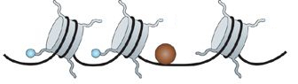

* <span class="pt">Histone modifications</span>

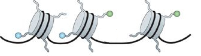


## Experiment Overview

<div style="width: 60%; 
            float: left"> 
<span style="color: #FFFFFF;">.</span>
            
</div>

<div style="margin-left: 60px;
            float: none;">
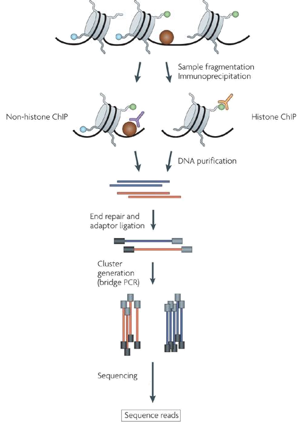
</div>

<div style="text-align: right">
<p style="font-size: 14px">Image adapted from: Park P (2009), Nature Reviews Genetics, 10, 669-680.</p>
</div>

## Experiment Overview

<div style="width: 60%; 
            float: left"> 

+----------------------------------------------------+---------------------------------------------------------------------------------+
| <span class="smtabtext">Resolution</span>          | <span class="smtabtext">High - single nucleotide</span> |
+----------------------------------------------------+---------------------------------------------------------------------------------+
| <span class="smtabtext">Coverage</span>            | <span class="smtabtext">Limited by “alignability” of reads to the genome</span> |
+----------------------------------------------------+---------------------------------------------------------------------------------+
| <span class="smtabtext">Cost</span>                | <span class="smtabtext">Around £1000 per lane</span> |
+----------------------------------------------------+---------------------------------------------------------------------------------+
| <span class="smtabtext">Source of noise</span>     | <span class="smtabtext"> Sequencing bias, GC bias, Sequencing error </span>   |
+----------------------------------------------------+---------------------------------------------------------------------------------+
| <span class="smtabtext">Amount DNA required</span> | <span class="smtabtext">Low 10 - 50 ng</span> |
+----------------------------------------------------+---------------------------------------------------------------------------------+
| <span class="smtabtext">Multiplexing</span>        | <span class="smtabtext">Possible</span> |
+----------------------------------------------------+---------------------------------------------------------------------------------+

</div>

<div style="margin-left: 60px;
            float: none;">

</div>

<div style="text-align: right">
<p style="font-size: 14px">Image adapted from: Park P (2009), Nature Reviews Genetics, 10, 669-680.</p>
</div>

## Sample Preparation

|          | Transcription factor binding | Histone modifications and Nucleosome positioning |
|:--------:|:-----------------------------|:-------------------------------------------------|
| Crosslinking | Formaldehyde | Usually not |
| Fragmentation | Sonication(200-600bp) | MNase Treatment |
| Immunoprecipitation | Antibody specific to protein |Antibody specific to histonemodification or histone |


## Experimental Design

<ul style="font-size: 30px">
  <li class="pkht">Antibody quality</li>
  <li>Control experiment</li>
  <li>Depth of sequencing</li>
  <li>Multiplexing</li>
  <li>Paired-end reads</li>
</ul>


## ANTIBODY QUALITY

* Antibody quality - a <span class="pkth">sensitive</span>
and <span class="pkth">specific</span>antibody will give a high level of enrichment

    * <span class="pt">Limited efficiency of antibody is the main reason for failed ChIP-seq experiments</span>
    
* Check your antibody ahead if possible

    * <span class="pt">Western blotting to check the reactivity of the antibody with unmodified and non-histone proteins</span>
    
* Optimize ChIP protocol

    * <span class="pt">If known positives and negatives are available, perform qPCR to demonstrate enrichment for these regions</span>

## Experimental Design

<ul style="font-size: 30px">
  <li>Antibody quality</li>
  <li class="pkht">Control experiment</li>
  <li>Depth of sequencing</li>
  <li>Multiplexing</li>
  <li>Paired-end reads</li>
</ul>

## The Need for a Control Sample

<div style="width: 40%; 
            float: left"> 
            
* Open chromatin regions are fragmented more easily than closed regions.
            
* Repetitive sequences might seem to be enriched (inaccurate repeats copy number in the assembled genome).
            
* Uneven distribution of sequence tags across the genome 
            
* A ChIP-seq peak should be compared with the same region in a matched control
            
</div>

<div style="margin-left: 60px;
            float: none;">
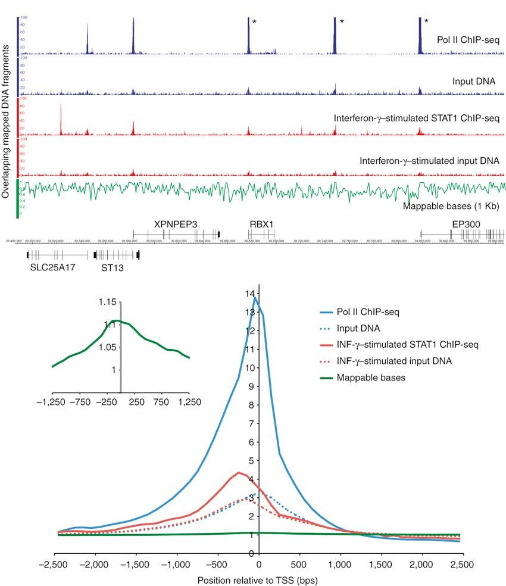
</div>

<div style="text-align: right">
<p style="font-size: 14px">Image adapted from: Rozowsky et al. (2009) Nature Biotechnology, 27:66-75.</p>
</div>

<!-- 
https://www.nature.com/articles/nbt.1518/figures/1?proof=trueIn&draft=journal
-->

<!-- 

## CONTROL TYPE

* Input DNA

* Mock IP - DNA obtained from IP without antibody

    * <span class="pt">Very little material can be pulled down leading to inconsistent results of multiple mock IPs</span>

* Nonspecific IP - using an antibody against a protein that is not known to be involved in DNA binding

* Sequencing a control can be avoided when looking at:

    * time points

    * differential binding pattern between conditions

## Experimental Design

<ul style="font-size: 30px">
  <li>Antibody quality</li>
  <li>Control experiment</li>
  <li class="pkht">Depth of sequencing</li>
  <li>Multiplexing</li>
  <li>Paired-end reads</li>
</ul>

## Sequencing Depth

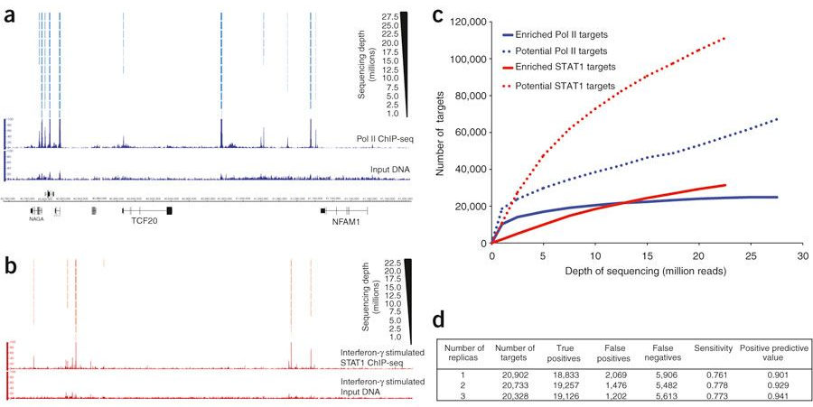

* More prominent peaks are identified with fewer reads, versus weaker peaks that require greater
depth

* Number of putative target regions continues to increase as a function of sequencing
depth

<div style="text-align: right">
<p style="font-size: 14px">Image adapted from: Rozowsky et al. (2009) Nature Biotechnology, 27:66-75.</p>
</div>

## Sequencing Depth


* With current sequencing technologies for human/mouse >20M uniquely mapped reads is usually sufficient

* HiSeq 4000 - ~300-350 Million reads per lane

<div style="text-align: right">
<p style="font-size: 14px">Image adapted from: Rozowsky et al. (2009) Nature Biotechnology, 27:66-75.</p>
</div>

## Experimental Design

<ul style="font-size: 30px">
  <li>Antibody quality</li>
  <li>Control experiment</li>
  <li>Depth of sequencing</li>
  <li class="pkht">Multiplexing</li>
  <li>Paired-end reads</li>
</ul>


## Sample barcoding and de-multiplexing

<div style="width: 50%; 
            float: left"> 
            
### Barcoding 

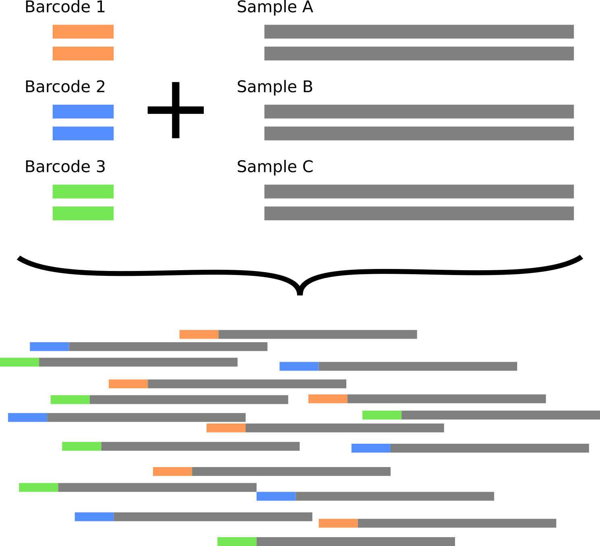
</div>

<div style="margin-left: 560px;
            float: none;">
            
### Demultiplexing

<div style="margin-top: 50px">
* Read 1  
<span style="font-family: courier new"><span style="color: #ff9955">ATTAGG</span>CCTAAGCA</span>... - Sample A
* Read 2  
<span style="font-family: courier new"><span style="color: #5588ff">GAGCAA</span>CGACTACT</span>... - Sample B
* Read 3  
<span style="font-family: courier new"><span style="color: #ff9955">ATTAGG</span>CCATACAT</span>... - Sample A
* Read 4  
<span style="font-family: courier new"><span style="color: #75e654">CCATAG</span>GCTGACTA</span>... - Sample C
</div>
</div>

## Experimental Design

<ul style="font-size: 30px">
  <li>Antibody quality</li>
  <li>Control experiment</li>
  <li>Depth of sequencing</li>
  <li>Multiplexing</li>
  <li class="pkht">Paired-end reads</li>
</ul>

## Paired-End Sequencing


* DNA fragments are sequenced from both ends

* Increases “mappability” - especially in repetitive regions

* Reduced duplicates

* Costs twice as much as single end reads

* For ChIP-seq, usually not worth the extra cost, unless you have a specific interest in repeat regions

## Analysis Workflow Overview

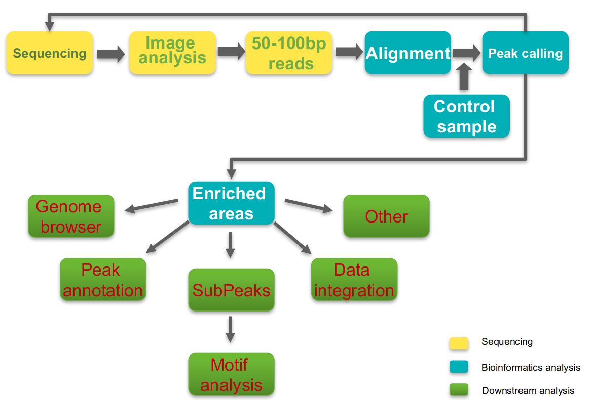

-->

## Alignment

**Goal**: Given a reference sequence and a set of short reads, align each read
to the most likely origin of the fragment from which the read came.

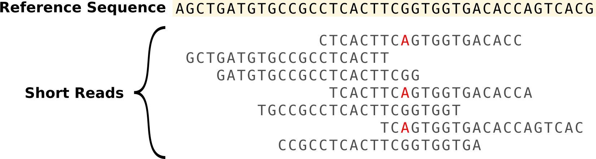

## Alignment

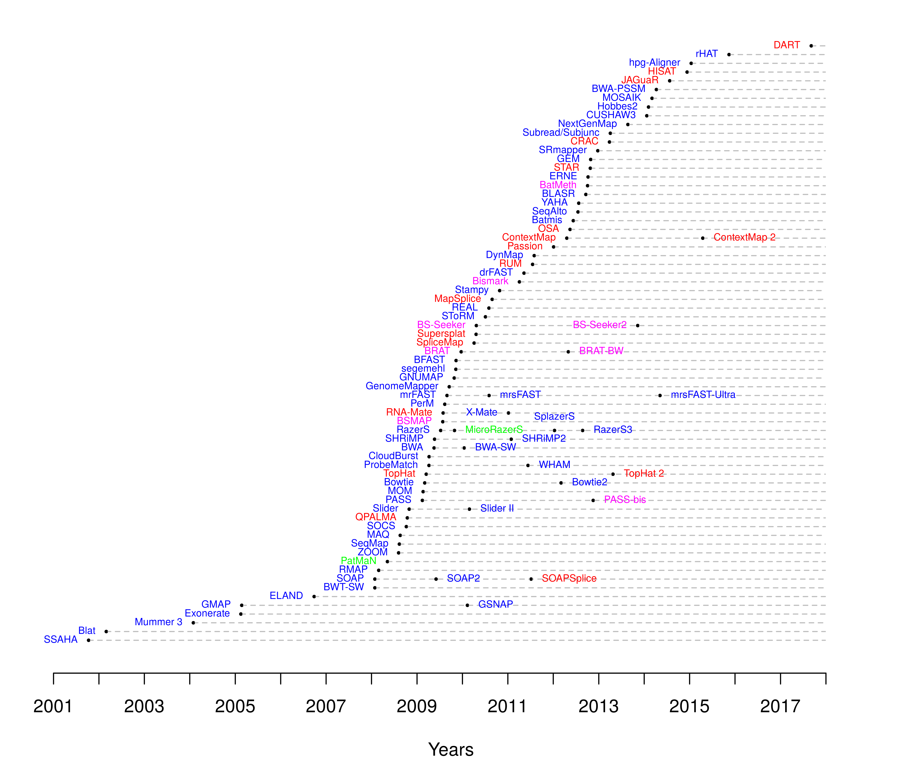

## Mappability

* Not all of the genome is ‘available’ for mapping

* Align your reads to the unmasked genome

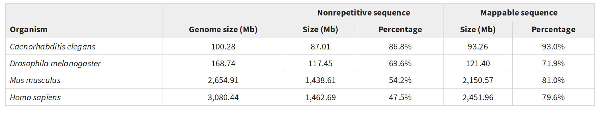


<div style="text-align: right">
<p style="font-size: 14px">Table from: Rozowsky et al. (2009) Nature Biotechnology, 27:66-75.</p>
<p style="font-size: 14px">\*Figure calculated based on 30nt sequence tags</p>
</div>

* <span class="pt">For ChIP-seq, usually short reads are used (50/100bp)</span>

## Reads can map in multiple locations

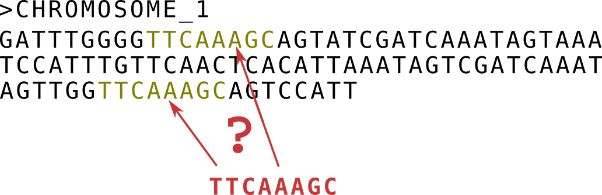

* Some parts of the genome will not be unique:

    * Common, repeated motifs (proteins domains)

    * Repeat regions

## Duplicate reads

* Reads that align in exactly the same place (same start + same CIGAR string)
    
* Duplicates can occur from:

    * Artefacts from sequencing (PCR artefacts)
    
    * Real biological signal
    
    * We cannot tell apart which one, unless we use barcodes.
    
## Quality Control - alignment

```{r echo=FALSE, message=FALSE, fig.align='center'}
library(tidyverse)
read_tsv("dummy_alignment_data.tsv.csv") %>% 
  gather("Type", "Count", -SampleName) %>% 
  mutate(Type=factor(Type, levels=c("Unmapped", "Duplicate", "Q<15 reads", "Q>15 reads"))) %>% 
  ggplot(aes(x=SampleName, y=Count)) +
     geom_col(aes(fill=Type), colour="black") +
     labs(x=NULL, fill=NULL, y="Number of Reads")
```

## Quality Control - Enrichment

<!--
<div style="width: 20%; 
            float: left"> 
            
<div style="margin-top: 50px">
Lack of coverage in the IP
</div>
<div style="margin-top: 240px">
IP successful
</div>
-->

</div>

<div style="width: 60%; 
            float: left"> 
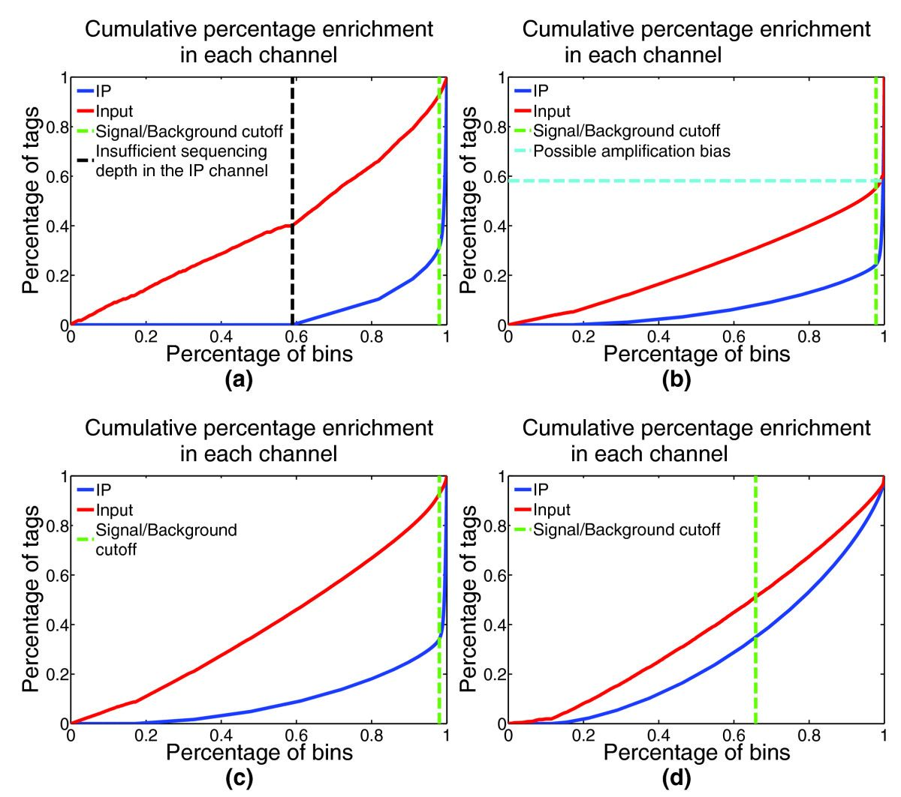

</div>

<!--
#<div style="width=20%;">            
<div style="margin-top: 150px">
Amplification Bias
</div>
<div style="margin-top: 240px">
Weak IP
</div>

</div>
-->

## Analysis Workflow Overview


## 


