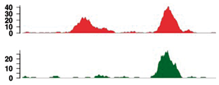
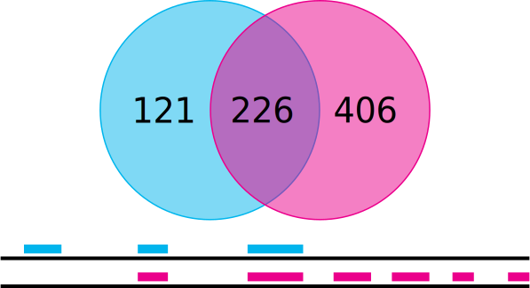
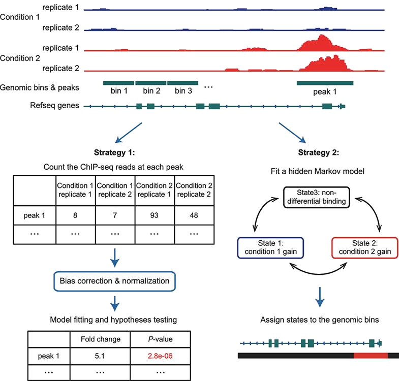
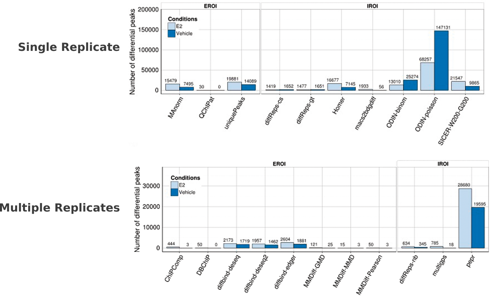

```{r setup, include = FALSE}
knitr::opts_chunk$set(echo = FALSE)
```

## Differential binding analysis

* The same **transcription factor** has different binding profiles in different conditions



* The same **histone modification** has different patterns of occurrence patterns in different conditions


## Differential binding analysis



## Strategies {#less_space_after_title}



## Count-based methods


## Tools


<div style="text-align: right; margin-top: 60px;">
Steinhauser et al., Briefings in Bioinformatics (2016) 
[doi.org: 10.1093/bib/bbv110](https://doi.org/10.1093/bib/bbv110)
</div>

## Peak Calling comparison - Transcription Factors (FOXA1) 



## Peak Calling comparison - Transcription Factors (FOXA1) {#less_space_after_title}


## Key Points

* There are differences between the tools to perform differential binding
  analysis  

* Methods considering replicates are more robust than those considering single
  data sets only

* Some tools give good results with default parameters e.g. ChIPComp and
  diffBind when replicates are available

* The other tools require more extensive fine-tuning of parameters to achieve
  satisfactory results


