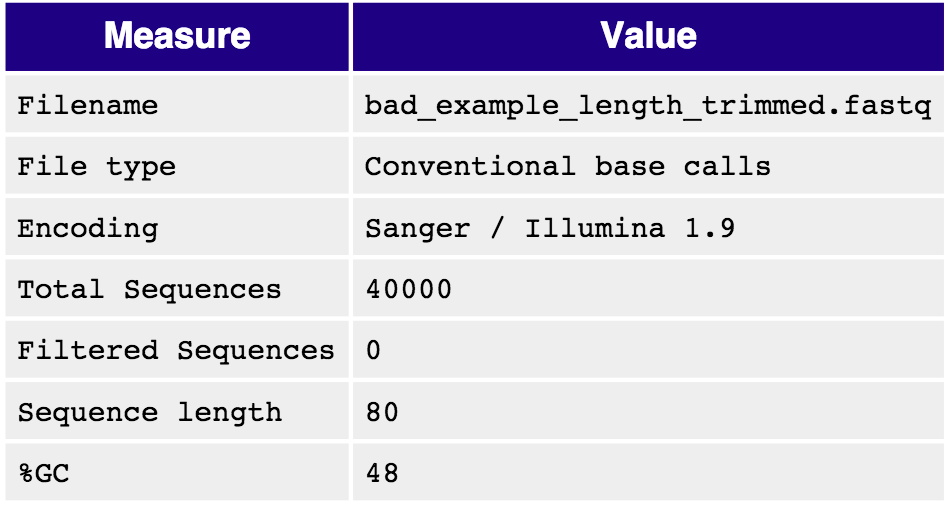
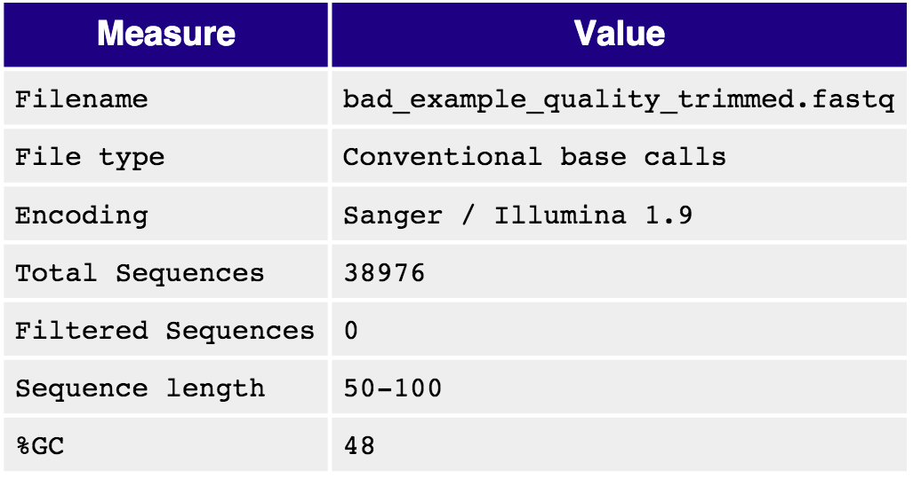

## QUALITY CONTROL PRACTICAL
University of Cambridge, October 2019

Sandra Cortijo [sandra.cortijo@slcu.cam.ac.uk](sandra.cortijo@slcu.cam.ac.uk)

Sergio Martinez Cuesta [Sergio.MartinezCuesta@cruk.cam.ac.uk](Sergio.MartinezCuesta@cruk.cam.ac.uk)

Sankari Nagarajan [Sankari.Nagarajan@cruk.cam.ac.uk](Sankari.Nagarajan@cruk.cam.ac.uk)

Ashley Sawle  [Ashley.Sawle@cruk.cam.ac.uk](Ashley.Sawle@cruk.cam.ac.uk)

# General information

The following standard icons are used in the hands-on exercises to help you locating:


 Important Information

 General information/notes

 Follow the following steps

 Questions to be answered 

 Warning – PLEASE take care and read carefully

 Optional Bonus exercise

 Optional Bonus exercise for a champion

## Resources used

FastQC: [http://www.bioinformatics.babraham.ac.uk/projects/fastqc/](http://www.bioinformatics.babraham.ac.uk/projects/fastqc/)

fastx-toolkit: [http://hannonlab.cshl.edu/fastx_toolkit/](http://hannonlab.cshl.edu/fastx_toolkit/)

## Going on a blind date with your read set?  For a better understanding of the consequences please check the data quality!


 For the purpose of this tutorial we are focusing only on the Illumina sequencing which uses 'sequence by synthesis' technology in a highly parallel fashion. Although Illumina high throughput sequencing provides highly accurate sequence data, several sequence artefacts, including base calling errors and small insertions/deletions, poor quality reads and primer/adapter contamination are quite common in the high throughput sequencing data. The primary errors are substitution errors. The error rates can vary from 0.5-2.0% with errors mainly rising in frequency at the 3' ends of reads.

One way to investigate sequence data quality is to visualise the quality scores and other metrics in a compact manner to get an idea about the quality of a read data set. Read data sets can be improved by post processing in different ways like trimming off low quality bases, cleaning up the sequencing adapters if any, removing PCR duplicates if required. We can also look at other statistics such as, sequence length distribution, base composition, sequence complexity, presence of ambiguous bases etc. to assess the overall quality of the data set. Highly redundant coverage (>15X) of the genome can be used to correct sequencing errors in the reads before assembly and errors. Various k-mer based error correction methods exist but are beyond the scope of this tutorial.
To investigate sequence data quality we would demonstrate tools called FastQC ([http://www.bioinformatics.babraham.ac.uk/projects/fastqc/](http://www.bioinformatics.babraham.ac.uk/projects/fastqc/)) and fastx-toolkit ([http://hannonlab.cshl.edu/fastx_toolkit/](http://hannonlab.cshl.edu/fastx_toolkit/)). FastQC will process and present the reports in visual manner. Based on the results the sequence data can be processed using the fastx-toolkit.

# Prepare the environmnet

Open the Terminal.


First, go to the right folder, where the data are stored.

```
cd ~/Desktop/QC/
```

# Understand the quality encoding of your data

 

Before any bioinformatic analysis it is essential to know which quality encoding the fastq formatted reads are in.

# Questions 

1. Can you tell which quality encoding our good_example.fastq formatted reads are in?

Hint: Look at the first few reads of the file `good_example.fastq` by typing: 

```
head -n 20 good_example.fastq
```
2. Compare the quality strings with the table found at [http://en.wikipedia.org/wiki/FASTQ_format#Encoding](http://en.wikipedia.org/wiki/FASTQ_format#Encoding)

# Running FastQC
FastQC is installed on your computer and can be launched by typing:


```
fastqc &

```
Follow the on-screen instructions to load and analyse the file `bad_example.fastq`, which is located under the folder /home/participant/Desktop/QC/. Do the same for the file `good_example.fastq` in the same folder.

## Quality visualisation

On running FastQC, it will generate a QC report, containing several items. For example, the report file will have a **Basic Statistics** table and various graphs and tables for different quality statistics.

![FastQC Basic Statistics]{plots/qc/bad_basic_stats.png)

In addition, FastQC reports information about the quality scores of the reads.

 expresses an error probability. In particular, it serves as a convenient and compact way to communicate very small error probabilities.
Given an assertion, A, the probability that A is not true, P(~A), is expressed by a quality score,Q(A), according to the relationship:


$$Q(A) =-10 log10(P(~A))$$

where P(~A) is the estimated probability of an assertion A being wrong.
The relationship between the quality score and error probability is demonstrated with the following table:

| Quality score, Q(A) | Error probability, P(~A) |
| ---- | --- |
| 10 | 0.1 |
| 20 | 0.01 |
| 30 | 0.001 |
| 40 | 0.0001 |

			
 

## Questions

1. How many sequences were there in the `bad_example.fastq`? What is the read length?  
	1. Does the quality score value vary throughout the read length? (hint: look at the 'per base sequence quality plot')  
	2. What is the quality score range you see?  
2. At around which position do the scores start falling below Q20?  
3. Why does the quality deteriorate at the end of the read?  
4. How can we trim the reads to filter out the low quality data?  

Sequencing errors can complicate the downstream analysis, which normally requires that reads be aligned to each other (for genome assembly) or to a reference genome (for detection of mutations). Sequence reads containing errors may lead to ambiguous paths in the assembly or improper gaps. In variant analysis projects sequence reads are aligned against the reference genome. The errors in the reads may lead to more number of mismatches than expected due to mutations alone. But, if these errors can be removed or corrected, the reads alignment and hence the variant detection will improve. The assemblies will also improve after pre-processing the reads with errors.


## Removing duplicates

Duplicate reads are the ones having the same start and end coordinates. This may be the result of technical duplication (too many PCR cycles), or over-sequencing (very high fold coverage). It is very important to put the duplication level in context of your experiment. For example, duplication level in targeted or re-sequencing projects may mean different than in RNA-seq experiments. In RNA-seq experiments over-sequencing is usually necessary when detecting the low expressed transcripts.
The duplication level computed by **FastQC** is based on sequence identity at the end of reads. Another tool, **Picard**, determines duplicates based on identical start and end positions.

**In this practical we are not going to cover Picard. However, we provide the following for your information.**

Picard is a suite of tools for performing many common tasks with SAM/BAM format files. For more information see the Picard website and information about the various command-line tools available:

[http://picard.sourceforge.net](http://picard.sourceforge.net)

[http://picard.sourceforge.net/command-line-overview.shtml](http://picard.sourceforge.net/command-line-overview.shtml)

One of the Picard tools (MarkDuplicates) can be used to analyse and remove duplicates from the raw sequence data. The input for Picard is a sorted alignment file in `.bam` format. Short read aligners such as, bowtie, BWA, tophat etc. can be used to align fastq files against a reference genome to generate SAM/BAM alignment format.
However interested users can use the following general command to run the MarkDuplicates tool at their leisure and only need to provide a BAM file for the INPUT argument:

```
java -jar /usr/share/java/picard/MarkDuplicates.jar  INPUT=<alignment_file.bam>  VALIDATION_STRINGENCY=LENIENT  OUTPUT=alignment_file.dup  METRICS_FILE=alignment_file.matric  ASSUME_SORTED=true REMOVE_DUPLICATES=true
```


## BONUS: Read Trimming


The read trimming can be done in a variety of different ways. Choose a method which best suits your data. Here we are giving examples of fixed-base trimming and quality score-based trimming.

### Fixed Length Trimming

Low quality read ends can be trimmed using a fixed length timmer. We will use the **fastx_trimmer** from the fastx-toolkit. Type `fastx_trimmer -h` at anytime to display the various options you can use with this tool.
In order to do fixed trimming with the fastq file `bad_example.fastq` use the following command. The output will be stored in `bad_example_length_trimmed.fastq`.


```
cd ~/Desktop/QC/
fastx_trimmer -h
fastx_trimmer -f 1 -l 80 -i bad_example.fastq -o bad_example_length_trimmed.fastq
```

Run FastQC on the resulting file.

<div style="width: 50%">

</div>


### Quality Based Trimming
Base call quality scores can also be used for trimming sequence end. A quality score threshold and minimum read length after trimming can be used to remove low quality data:


```
fastq_quality_trimmer -h
fastq_quality_trimmer -Q 33 -t 20 -l 50 -i bad_example.fastq -o bad_example_quality_trimmed.fastq
```
Again, run FastQC on the resulting file.

<div style="width: 50%">

</div>


 

## Questions

1. How did the quality score range change with the two types of trimming?  
2. Did the number of total reads change after the two types of trimming?    
3. What read lengths were obtained after quality based trimming?  
4. Did you observe adapter sequences in the data?  

# Advanced Options:

## Adapter Clipping

Sometime sequence reads may end up getting the leftover of adapters and primers used for the sequencing process. It's a good practice to screen your data for these possible contaminations for more sensitive alignment and assembly based analysis. This is usually a necessary steps in sequencing projects where read lengths are longer than the molecule sequenced, for example when sequencing miRNAs.
Various QC tools are available to screen and/or clip these adapter/primer sequences from your data. (e.g. FastQC, fastx, cutadapt)
Here we are demonstrating `fastx_clipper` to trim a given adapter sequence. Use `fastx_clipper -h` to display help at anytime.


```
cd ~/Desktop/QC/
fastx_clipper -h
fastx_clipper -v -Q 33 -l 20 -M 15 -a GATCGGAAGAGCACACGTCTGAACTCCAGTCACCGATGTATCTCGTATGC -i adapter_contamination.fastq -o adapter_contamination_clipped.fastq
```
An alternative tool, not installed on this system, for adapter clipping is `fastq-mcf`. A list of adapters is provided as a list in a text file. For more information, see: [http://code.google.com/p/ea-utils/wiki/FastqMcf](http://code.google.com/p/ea-utils/wiki/FastqMcf)

